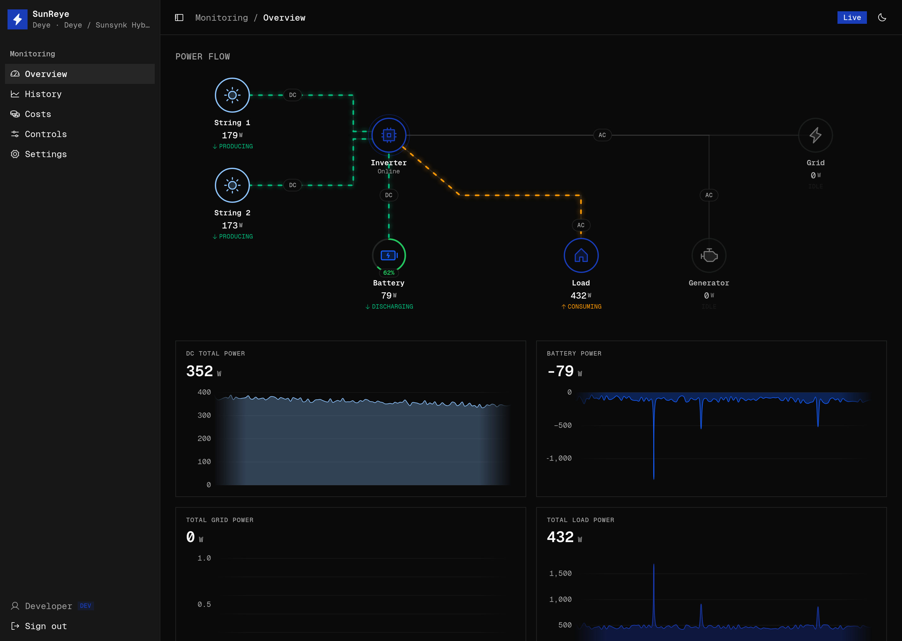

import { Card, CardGrid, LinkCard } from "@astrojs/starlight/components";

SunReye polls your inverter over Modbus, stores every reading as time-series data, and
gives you a live dashboard, a typed REST API, and an MQTT bridge with Home Assistant
auto-discovery — all generated from a single description of the inverter.

## What it does

<CardGrid>
  <Card title="Live monitoring" icon="laptop">
    1 Hz polling streamed to the browser over WebSocket. The dashboard renders itself
    from the active inverter's capabilities — PV strings, battery, grid phases,
    generator, backup load.
  </Card>
  <Card title="History & analytics" icon="bars">
    Every sample persisted to TimescaleDB, with per-minute / hourly / daily rollups so
    multi-week charts stay cheap. Automatic retention cleanup.
  </Card>
  <Card title="Control" icon="setting">
    Writable settings — charge/discharge currents, work mode, grid charge, solar-sell —
    exposed as validated controls, guarded by the same validation everywhere.
  </Card>
  <Card title="Costs & tariffs" icon="seti:shell">
    Turn energy flows into money: import/export tariffs, time-of-use bands, savings vs.
    grid-only, self-sufficiency and self-consumption.
  </Card>
  <Card title="Integrations" icon="puzzle">
    An auto-generated REST API (`/api/v1`) with OpenAPI docs, plus an MQTT bridge with
    Home Assistant MQTT Discovery.
  </Card>
  <Card title="Profiles as data" icon="open-book">
    An inverter ships as a *profile* — a description of its register map plus semantic
    metadata. Adding hardware means adding data, not forking the engine.
  </Card>
</CardGrid>

## Start here

<CardGrid>
  <LinkCard title="Quick Start" href="/start/quick-start/" description="Run the whole stack against the built-in simulator in five minutes — no hardware." />
  <LinkCard title="Architecture" href="/start/architecture/" description="How the profile drives the dashboard, the API, and the MQTT topics." />
  <LinkCard title="Deploy with Docker" href="/deploy/docker/" description="Build and run web + server with Docker Compose." />
  <LinkCard title="Author a profile" href="/profiles/authoring/" description="Describe a new inverter with the typed profile SDK." />
</CardGrid>
