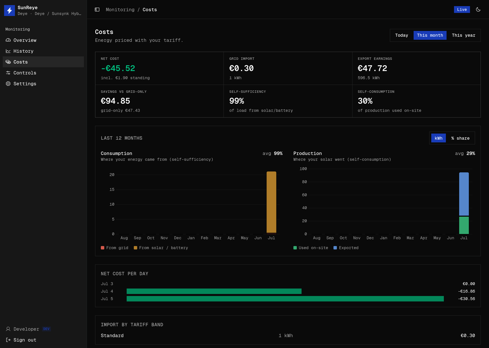

The **Costs** screen (`/costs`) turns energy flows into money using the tariff you configure
in [Settings → Tariff](/use/settings/). It's analysis over telemetry SunReye already stores
— no extra polling.

## Range and headline tiles

A range switcher (**Today / This month / This year**) drives six headline tiles, formatted
in your tariff currency:

| Tile | Meaning |
| --- | --- |
| **Net cost** | Total bill including the standing charge (shown as a credit when negative). |
| **Grid import** | Cost and kWh drawn from the grid. |
| **Export earnings** | Earnings and kWh exported (feed-in). |
| **Savings vs grid-only** | What you saved versus buying everything from the grid. |
| **Self-sufficiency** | % of your load met by solar/battery. |
| **Self-consumption** | % of your production used on-site. |

## 12-month energy split

An independent 12-month view (not tied to the range switcher) with a **kWh / % share**
toggle and two charts:

- **Consumption** — from grid vs from solar/battery, captioned with average
  self-sufficiency.
- **Production** — used on-site vs exported, captioned with average self-consumption.

## Detail

- **Net cost per day** — a horizontal bar per day (green bars for credit days).
- **Import by tariff band** — kWh and cost per time-of-use band, when bands are configured.

## Configuring the tariff

Set currency, standing charge, feed-in rate, a default import price, and time-of-use import
bands (each with a price, hour range, and weekday selection) in
[Settings → Tariff](/use/settings/). Everything on this screen updates from that model.
