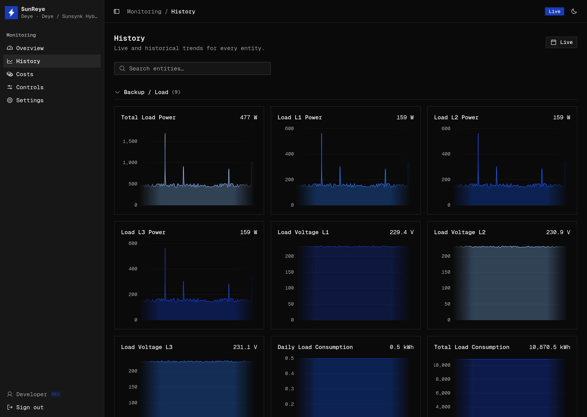

The **History** screen (`/history`) shows live and historical trends for *every* chartable
entity in one grid. It's backed by TimescaleDB: raw samples for recent windows, and
continuous-aggregate rollups (per-minute / hourly / daily) for longer spans, so multi-week
charts stay fast.

## Layout

- A **date-range picker** at the top controls the window for every chart at once.
- A **search box** filters entities by label or key.
- Entities are grouped into collapsible **categories** — Solar, Battery, Grid, Backup/Load,
  Consumption, Generator, Inverter — derived from each metric's role. The grid is
  responsive (1–3 columns).
- Only "chartable" metrics (measurements and cumulative counters) appear.

## Date range

The picker offers presets — **Live**, 1 hour, 6 hours, 24 hours, last week, last 14 days,
last month, last 6 months, last 12 months — plus a custom calendar range. The rollup bucket
(minute / hour / day) is chosen automatically from the span.

## Entity cards

Each metric gets a card showing its title and live current value. Cards **lazy-mount as you
scroll**, so a big grid stays light.

- In the **Live** range, the card draws a continuously gliding sparkline from the in-memory
  buffer.
- For any historical range, it fetches rollups and draws an area chart with a smooth curve,
  axes, gridlines, and a formatted tooltip.
- **Signed** metrics (those with a flow direction, like battery or grid power) use a
  red/green diverging gradient split at zero.

## Retention

Raw samples are kept for a bounded window (recent history), while the rollups retain
long-range trends cheaply; older telemetry is compressed and cleaned up automatically. This
is why the very long ranges draw from rollups rather than raw rows.
