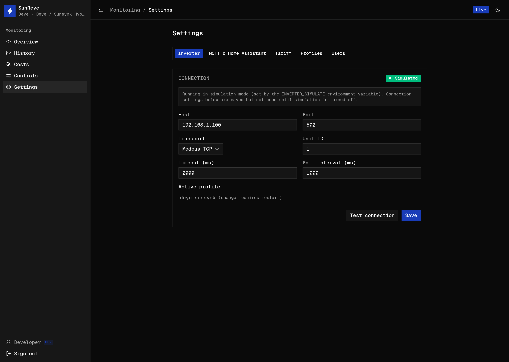

The **Settings** screen (`/settings`) is where the deployment is configured at runtime —
most of it without touching `.env` or restarting. The whole screen is **admin-only**. A
live status poll keeps the connection badges fresh.

Tabs: **Inverter**, **MQTT & Home Assistant**, **Tariff** (any admin), plus **Profiles** and
**Users** (admin).

## Inverter

Configure the **Modbus connection**: host, port, transport (**Modbus TCP** or
**RTU-over-TCP**), unit id, timeout, and poll interval. A status badge shows Connected /
Disconnected / Simulated.

- **Test connection** captures a live snapshot and opens a table (metric / group / value)
  so you can sanity-check the mapping before saving.
- **Save** applies the change live — no restart.
- The **active profile** is shown here read-only; changing it lives on the
  [Profiles](#profiles) tab and takes effect on restart.
- If simulation mode is on (`INVERTER_SIMULATE`), a notice explains the settings are saved
  but unused.

## MQTT & Home Assistant

Configure the [MQTT bridge](/integrations/mqtt/): enable switch, broker URL, topic prefix,
username, and a write-only password field. A **Home Assistant discovery** switch reveals the
discovery prefix. A status badge shows Disabled / Connecting… / Connected, with a **Test
connection** button. Saving applies live.

## Tariff

Configure pricing for the [Costs](/use/costs/) screen: currency, standing charge, feed-in
rate, a default import price, and **time-of-use bands** (name, price, hour range, weekday
selection). Add or remove bands and **Save tariff**.

## Profiles

Manage inverter [profiles](/profiles/concept/) (admin only), in three sections:

- **Installed profiles** — set active or remove, with built-in vs downloaded and version
  shown. A **Restart required** banner appears after activating or installing.
- **Profile repositories** — add/remove/enable git repo sources.
- **Available profiles** — **Browse** enabled repos, then Download / Update per profile.

See [Distributing Profiles](/profiles/distribution/) for the full flow.

## Users

Manage accounts (admin only): add a user (name, email, password, role) and edit or delete
users in a table, including changing roles inline. See [Users & Roles](/use/users/).

:::note
Client-side admin gating is UX only — every mutation is enforced on the server.
:::
